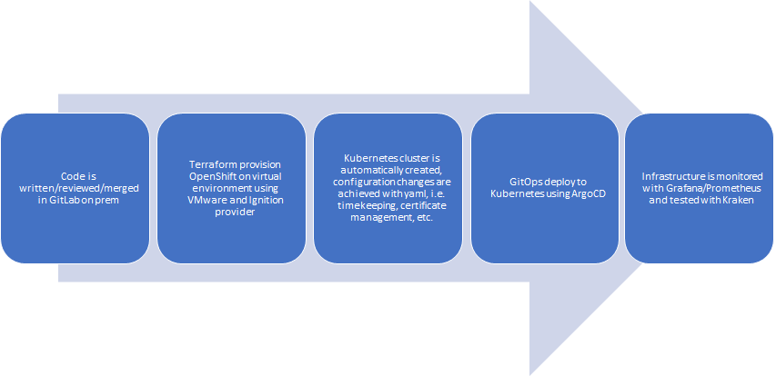
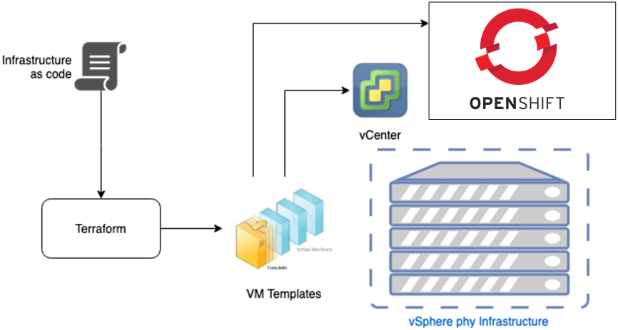
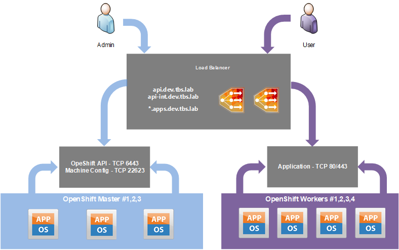

# **This a process of setting up an OpenShift cluster with Terraform.**

**Steps:**

1. Init

- [ ] Create **install-config.yaml**

- [ ] Generate the Kubernetes manifests and Ignition configs for each node. Execute **generate-manifests.sh**

-  ocp % tree openshift 
-  openshift
-  ├── auth
-  │   ├── kubeadmin-password
-  │   └── kubeconfig
-  ├── bootstrap.ign
-  ├── master.ign
-  ├── metadata.json
-  └── worker.ign

2. IaC - Initiate an OpenShift cluster deploy

- [ ] Automatic initialization of OpenShift cluster

- https://registry.terraform.io/providers/hashicorp/vsphere/latest/docs
- https://registry.terraform.io/providers/community-terraform-providers/ignition/latest/docs#example-usage

| Node | Ip address |
| ------ | ------ |
| ocp-lb | Address 1 |
| ocp-master1 | Address 2 |
| ocp-master2 | Address 3 |
| ocp-master3 | Address 4 |
| ocp-worker1 | Address 5 |
| ocp-worker2 | Address 6 |
| ocp-worker3 | Address 7 |
| ocp-bootstrap | Address 8 |
| ocp-coredns | Address 9 |

3. Kubernetes - OpenShift overview

- [ ] Introduction to **OpenShift**
- [ ] Deploy operators - **ArgoCD**

4. GitOps - ArgoCD

- [ ] Build **Helm charts** for services
- [ ] Deploy **Web Page** from code

5. Second day actions

- [ ] Test and observe the infrastrcture with Grafana, Kraken, etc
